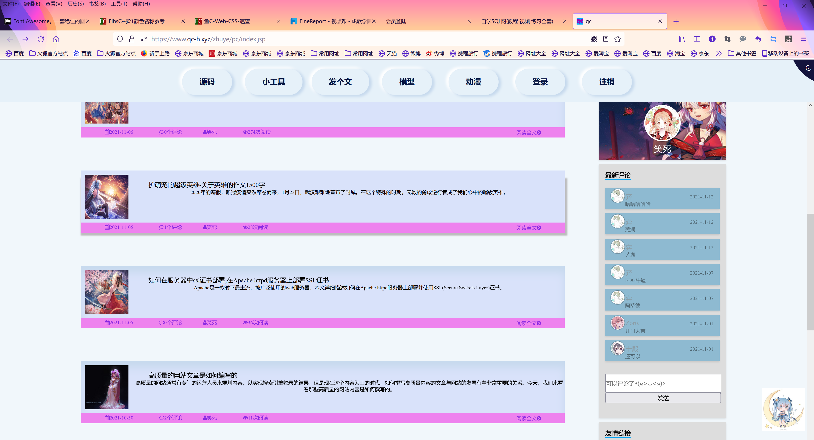
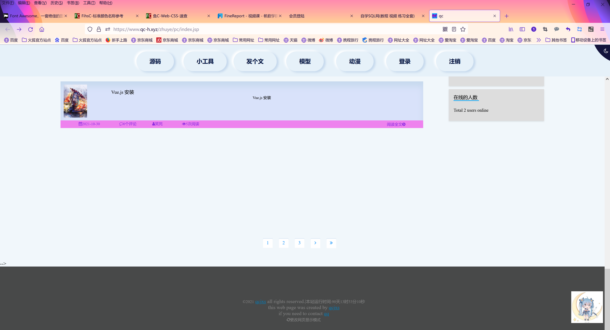
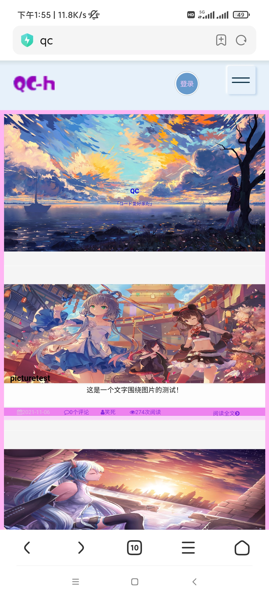

# **毕业设计--一个网站**
## **摘 要** :zany_face:
21世纪是一个高信息互联网的时代，互联网拉近了人们的距离，信息技术革新席卷了各个行业，技术也需要传播者，各种技术网站应运而生如GitHub、CSDN等等，让大家制作个人的网站变得轻松，一些技术性问题解决起来容易。所以我写了我的个人网站。
个人网站的系统设计是基于JSP技术的，未能圆满完成了整个系统的全面设计，所以我使用了多种语言开发了我的个人网站。本个人网站，采用一个简约的界面，操作方便，灵活，实用，整体连续性强，使之更加系统化体系化，标准化，自动化，具有优良的可用性，可靠性和安全性。本个人网站系采用JSP技术和HTML5开发，也运用PHP语言和框架技术，使用MySQL数据库，采用两种服务器：Apache、Tomcat，提高运行性能，安全性和系统性能，使用Xampp易于网站维护和操作。使用Ngrok和花生壳进行内网穿透，使其能够以个人电脑为服务器进行外网访问
##### **关键词**:个人网站；Java；MySQL数据库；Ngrok；花生壳
### 1.2 网站应用技术 :yum:
#### 1.2.1 开发语言的选择
在互联网领域当中，在Web服务端开发语言有Sun公司的Java、微软的ASP以及号称是世界上最好的编程语言的PHP、当然还有我们的老朋友标记性的语言HTML5。在大学教学课程中，我们专业学习了Java编程语言，我自学了PHP，所以选择了Java语言和PHP进行开发。下面将介绍Java语言和PHP的优点以及选择Java和PHP进行开发的优势。Java以其健壮性、高性能、分布式、安全性等优点而脱颖而出,并且在连续十年来成为程序员最喜欢的编程语言之一。PHP以执行速度快、具有很好的开放性和可扩展性、可伸缩性、具有丰富的功能。
#### 1.2.2 开发工具的选择
主流的Java IDE(Integrated Development Environment,集成开发环境)有Vs、NetBeans、Eclipse、IntelliJ IDEA、Vscode等。一个良好的开发工具能够达到事半功倍的效果，极大的提升开发效率。NetBeans是Sun公司推出的Java开发集成环境，但国内使用较少。Eclipse是一款开源的、使用Java语言开发的可扩展的集成开发环境，具有代码检测、自动编译、自动构建等特性。IntelliJ IDEA是JetBrains公司的产品，发布后便立即蚕食Eclipse市场份额。
我选择Eclipse和Vscode联合开发网站，开发网页非常好用。Vscode的优点：
（1）轻量级编辑器
Vscode是一款轻量级的编辑器，安装包非常小，而且启动速度非常快。虽然这对实际的项目没什么大的帮助，但是可以在无形间提高用户体验。
（2）丰富的插件系统
Vscode有着非常丰富的插件系统，无论你是编辑HTML、CSS、JS、TS、Vue、React等前端代码，还是Java、Python等后端代码。都可以找到相对应的插件，让我们如虎添翼，更快速地完成项目。
（3）代码跟踪功能
绝大多数情况下要使用Git来管理代码，这个时候Vscode会跟踪代码，非常明显地为标注：更改了那些文件，文件中你修改可第几行代码，对自己编写的代码一目了然。
#### 1.2.3 数据库的选择
在关系型数据库中，比较出色的有微软的Sql Server、甲骨文公司的Oracle数据库、GaussDB、以及开源数据库MySQL（被Oracle收购）。前三者为商业数据库，并且属于重量级数据库，虽然性能高，吞吐量大，但是占用系统资源较多，后期维护较困难。MySQL是一款开源免费的关系型数据库，运行速度快，容易使用，简单方便，支持标准的SQL查询语言，功能强大并且易于维护。最重要的是免费，因此，选择MySQL作为本网站的存储系统十分合适。
#### 1.2.4 内网穿透的选择
本网站采用内网穿透，进行外部网络访问，刚开始使用的是花生壳进行双映射，由于服务变化，现在只用一个映射。另一个映射采用Ngrok，操作简洁方便，隧道稳定，再加上自己写一个开机启动的Bat就更方便了。采用双映射对应不同的服务器。
#### 1.2.5 显示界面选择
用户看到浏览器端的界面大多是采用HTML、CSS、JAVASCRIPT来展示界面。开发 Web 应用程序和网站的前端框架，是基于 HTML、CSS、JAVASCRIPT 、PHP的框架。网站大部分的下拉菜单、创建图像、导航、弹出框、警告框，全局的 CSS 设置、可扩展的 Class、定义基本的 HTML 元素样式都由我独自编写。本有一些网站框架，但我开始制作时未了解，所以就自己写了。
#### 1.2.6 服务器的选择
服务器使用的双服务器运行，它们使用不同的端口，不同的映射。一个是Apache主要用于HTML5和PHP的运行，一是减轻压力，二是它不支持JSP。二个是Tomcat主要用于JSP和框架的运行，一是减轻压力，二是它不支持PHP。但是两个服务器在一起竟没有Bug,兼容还好，所以就继续用。
## **网站总体分析**:wave::love_you_gesture:
### 2.1 技术可行性分析
Java语言提供了一个共同的机制类似的借口动态模型，设计更集中。另外，在使用Java语言可以很容易实现模块化和存储信息。PHP语言支持多种主流与非主流的数据库。考虑到网站的实际情况，选择Java和PHP作为本网站开发语言的时候。通过上述分析，该网站的设计实现在技术方面是可行的。
### 2.2 操作可行性分析
本网站操作简单方便，界面简洁，对用户来而言，计算机专业知识不需要了解的很高深，就知道如何使用网站，就进行使用和维护网站。
### 2.3 经济可行性分析
本人独立完成了整个开发过程，实现全部的开发任务只需要一台PC机和上述的各种软件。由于PC机是我有的，软件运行无需专门升级硬件；而在网上又可以免费下载各种软件，因此，整个开发成本较小，只需要我的时间，时间越长就能进一步完善网站，为了能外网访问购买了便宜域名还有便宜隧穿隧道。在使用成本上，只要能连接上互联网上的PC和手机就行。并且没有很高的要求计算机和手机的硬件，软件方面也没有别的要求，访问与使用具有广泛性。因此，从经济可行性分析来看，性价比高。
## **网站主体实现**:writing_hand::pray::ok_hand:
### 3.1 前台界面设计及部分代码实现
#### 3.1.1 主页界面
页面内容测试使用不代表最终成果，所有代码太多大部分就不展示了，只留少的。如需请进入网站按F12进行观看。
通过访问https://www.qc-h.xyz,即可访问主页，但手机和PC所显示的主页不同，会进行分流，识别用户使用的是手机还是PC，PC端的访问主页如图3-1、图3-2、图3-3显示:

###### 图 3-1 主页界面

图 3-2 主页界面

图 3-3 主页界面
手机端的访问界面如图3-4、图3-5显示：
            
            图 3-4 主页界面                    图 3-5 主页界面

#### 3.1.2 发文界面
我们可以分享我们的有趣的故事，分享技术，还能写日志，在未来我将添加表情使用。如图3-6、图3-7、图3-8显示:

图 3-6 发文界面

图 3-7 发文界面

图 3-8 发文界面
#### 3.1.3 阅读文章页面
文章阅读页面有点赞、评论、分享等，如图3-9、图3-10显示:

图 3-9 阅读界面

图 3-10 阅读界面
#### 3.1.4 登录界面
网站主要采用静、动相结合的方式，即静态的主画面和动态的画面相结合。静态主页内容包括登录控件信息。动态的画面使用js进行构建，操作反馈明显。
登录界面如3-11所示：

图 3-11 登录信息界面
#### 3.1.5 分页一源码界面
通过使用点击源码按钮，用户可以进入源码分类页。
购物车界面中要实现3个方面的功能： 
（1）显示源码类型的列表：种类的名称。 
（2）有悬停动画
（3）各类源码入口。 
分页一源码界面如3-12所示：

图 3-12 源码界面
#### #### 3.1.6 404界面
用户的访问总是意想不到的所以总会有错误，404最为常见。所以404页面也很重要，由于网站使用两个不同服务器，404页也不同。
不同的404界面如3-13、3-14所示：

图 3-13 404界面

图 3-14 404界面
#### 3.1.7 在线评论界面
在信息的添加模块首先要将页面上的form表单数据提交处理页，使用Sql语句完成添加的操作，然后进行页面重刷。
用户在线评论界面如3-15所示:

图 3-15 用户评论界面
## **环境搭建**:person_feeding_baby::mechanic:
本程序是标准的java web工程，若要运行本程序需要满足以下条件：
（1）下载安装jdk 1.8 并且配置环境变量。
（2）下载安装xampp,即可使用Apache、Tomcat、MySQL，当然可以按照个人喜好进行安装不同版本。也可下载配置Tomcat 7.0及以上版本。
（3）下载花生壳和Ngrok,官方有帮助文档。
由于篇幅问题，运行环境的搭建不是本文研究的主要内容，以上三个软件安装都比较简单，关于以上三个软件怎么安装，可以从互联网上搜索相关图文安装教程。
### 3.3 网站部署
本程序是标准的Java EE工程，用eclipse源码会编译为qc-h.war包，部署时只需要将qc-h.war拷贝到 H:\xampp\tomcat\webapps\ROOT路径下，启动Tomcat即可。更多部署细节，请参考5.1网站调试章节。
### 3.4 本章小结
本章主要展现了网站的几个主要界面以及后台代码的实现，后两小结主要介绍了网站部署运行时所需要的软件环境以及部署步骤。在界面设计及代码实现部分详细介绍了登录、主页、404页、子页和评论模块的界面展现，代码实现，以及用户操作流程。
## **数据库** :eyes:  
数据库表设计
### 4.1
在MySQL数据库中用户表各个字段约束如表1所示，其中id是主键，用来标识一条唯一记录。其他字段如密码、姓名、用户类型用字符串存储。Table简单易修改。
表1 用户信息表
名	类型	长度	小数点	不是null	虚拟	键	注释
id	int	11	0	√		1	
user	varchar	255	0				用户名
nickname	varchar	255	0				昵称
pwd	varchar	255	0				密码
email	varchar	255	0				电子邮件
success	varchar	255	0	√			判断是否成功
### 4.2
在每一个应用程序中，数据库的设计是其中非常重要的部分，选择合适的数据库并创建合计的结构式开发程序时首要的问题。数据库将用MySQL进行设计和管理。数据库安全性就是保证数据库信息的保密性，完整性，一致性和可用性，防止非法用户越权使用数据库从而窃取，更改或破坏数据库中数据，将提供一些安全措施来保证数据库的安全。
在MySQL数据库中首页数据信息表各个字段约束如表2所示，其中id是主键，用来标识一条唯一记录。其他字段如网页文章显示标题、网页文章显示作者、网页文章显示图片类型用字符串存储。
表2 首页数据信息表
名	类型	长度	小数点	不是null	虚拟	键	注释
id	int	11	0	√		1	
title	varchar	255	0				标题
jj	varchar	500	0				简介
url	varchar	255	0				连接
date	date	0	0				日期
impicture	varchar	255	0				图片
zz	varchar	255	0				作者
yds	int	255	0				阅读数
pls	int	255	0				评论数

在MySQL数据库中评论数据表各个字段约束如表3所示，未有主键因为用户可能多次评论。其他字段如评论显示用户、评论显示、评论显示时间类型用字符串存储。
表3 评论数据表
名	类型	长度	小数点	不是null	虚拟	键	注释
username	varchar	255	0				用户名称
date	date	0	0				日期
title	varchar	255	0				标题
wz	varchar	5000	0				文章
## **网站调试与测试**:mechanic::monkey:
### 5.1 网站调试
在一个项目开发完成之后，就需要将代码部署到服务器中进行调试。假设服务器中已经安装完4.3小结中必须的四个软件jdk，Ngrok，Xampp（主页如图5-1），花生壳，下面将对这四个软件安装的正确性与否进行测试与调试，全部调试成功后，才能保证程序的正常运行。
             
图5-1 XAMPP
（1）jdk 测试
jdk安装完成后，需要配置环境变量。环境变量配置的原理是在操纵系统的环境变量中添加两个键值对。第一个键是JAVA_HOME，值为jdk的安装路径，第二个键是PATH，值为jdk目录下面的bin目录。将这两个键值对在操作系统中配置完成后，在控制台中输入 “java -version”命令，便可以正常输出当前jdk版本。
（2）xampp中MySQL调试
xampp安装完成后。点击Config，找到配置文件my.ini，--在 [# The MySQL server] 标签下加上以下内容：
default-character-set = utf8，character_set_server = utf8 保存并退出，最后重启MySQL即可。
（3）xampp中Tomcat调试与配置
Tomcat是一个Web服务器，只有把程序放到Tomcat中才能用浏览器进行访问。Tomcat服务器需要一个端口，由于默认的端口容易被计算机的其他进程所占用，所以我们先修改端口，在主页点击Tomcat的Config下的server.xml，也需要在Config下的web.xml中添加404页和首页路径，在本网站中Tomcat还有另外一个功能，即文件服务器[9]。在用http 协议访问/myfileupload 路径时，Tomcat利用框架将文件写入磁盘服务器的\usertx路径下。
（4）xampp中Apache调试与配置
Apache也是一个Web服务器，在主页点击Apache的Config下的Apache(httpd.conf)修改端口号。
以上四个步骤配置成功后，在项目的配置文件中，把数据库的连接信息配置为目标机的MySQL账号密码，依次启动MySQL服务器，启动Tomcat，启动Apache，在浏览器中正常访问项目的登录界面，如果登录成功，则网站调试成功。 后面可设置自启。
### 5.2 网站测试
软件测试就是在一个软件投入使用前，对软件进行需求分析，设计规格说明书和编码的最终复审，是软件质量保证的关键步骤。软件测试的指标有多个方面，如性能测试，功能测试，资源使用率等。
### 5.3 网站维护
一个正常的网站中，在运行期间难免会出现问题，因此需要进行不定期的网站维护。在网站中出现的问题大致分为两大类问题：硬件资源问题和软件问题。本网站的数据存储采用MySQL服务器，如果查询速度较慢，可以适当增加索引，另外当数据量达到一定规模后，为了提高网站吞吐量，可以采用数据库份库分表、读写分离等策略。如果遇到软件使用习惯、功能添加等问题，就必须修改源码，重新部署程序了。找到问题的原因，分析并且解决问题，是软件运行和维护的宗旨。
### 5.4 本章小结
本章介绍了网站完成的后续问题，网站调试、网站测试与维护。网站调试是调试网站所需的软件网站的调用关系，保证各个软件网站之间的通讯正常。网站测试主要介绍了网站的功能性测试，保证网站实现达到设计之初的要求。网站维护模块提出了网站在运行过程中可能出现的问题以及解决方案。                                                          
